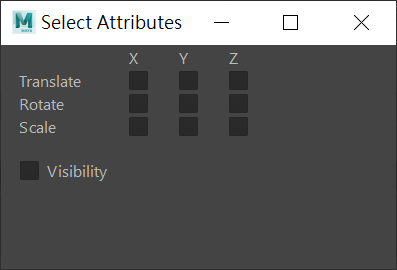
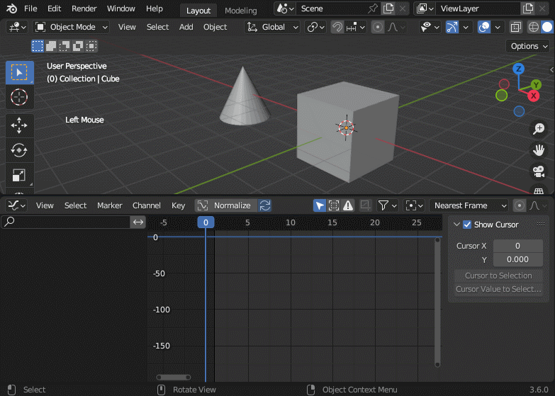
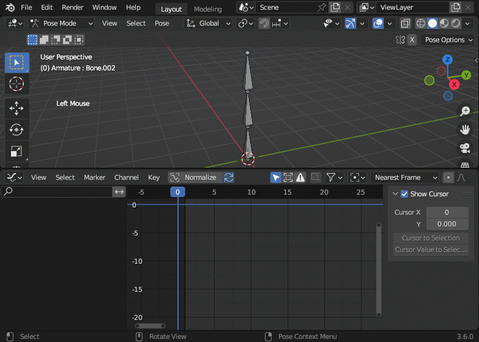

# Blender Highlight Channels

Highlight the specified animation channels across multiple objects by toggling their visibility (works on Blender 2.80+).

When editing an animation, it is often necessary to make adjustments to certain channels (e.g., Rotation X) of multiple bones. To ensure that only the relevant curves are visible in the Graph Editor, it is required to select the corresponding channels for all bones and hide the unselected channels. To automate this repetitive task, this add-on provides various hotkeys for quickly highlighting the specified channels across all selected objects.

This add-on has the same purpose as the [`Select Attributes`](https://help.autodesk.com/view/MAYAUL/2023/ENU/?guid=GUID-4C99B1CD-442F-4D15-AFB7-FF8D802B4D00#GUID-4C99B1CD-442F-4D15-AFB7-FF8D802B4D00__d1829e708) tool in Maya, while Maya exposes these operations through an GUI instead of hotkeys.



## Preview





## Installation

To install the add-on:

- Download the zip file of the [latest release](https://github.com/j3soon/blender-highlight-channels/releases).
- In Blender, go to `Edit > Preferences > Add-ons > Install`, select the downloaded zip file and click `Install Add-on`.
- Search for `Highlight Channels` in the search bar, and check the entry to enable the add-on.

To disable/uninstall the add-on, go to `Edit > Preferences > Add-ons`. Select `Community`, uncheck `Enable Add-ons Only`, select `All` categories, and search for `Highlight Channels`. Uncheck the entry to disable; expand the entry and click `Remove` to uninstall.

To update the add-on, first uninstall the add-on and re-install it.

## Usages

A channel is defined to be **Highlighted** if it is Selected and Visible.

To highlight a channel across all selected objects, select one or more objects in the `3D Viewport`, and then press the following hotkeys in the `Graph Editor` panel:

- `Alt` + {`Q`, `W`, `E`}: Toggle the highlighting state of the {`X Location`, `Y Location`, `Z Location`} channels.
- `Alt` + {`A`, `S`, `D`}: Toggle the highlighting state of the {`X Euler Rotation`, `Y Euler Rotation`, `Z Euler Rotation`} channels.
- `Alt` + {`Z`, `X`, `C`}: Toggle the highlighting state of the {`X Scale`, `Y Scale`, `Z Scale`} channels.
- `Alt` + `F`: Toggle the visibility of all channels and unselect them.

Please note that:
- the operations only apply to selected objects.
- the hotkeys are only available when the `Graph Editor` is active (i.e., mouse cursor is in the `Graph Editor` panel).
- The operations can also be found in the menu: `Graph Editor > Channel > Highlight Channels`.

## Development

In the `Scripting` workspace, open the `__init__.py` file in the `Text Editor` panel, and press `Run Script` to install the add-on. In certain cases, you may need to restart Blender between runs to prevent installing multiple instances of the add-on.

For better development experience (such as autocomplete), see [this post](https://b3d.interplanety.org/en/using-microsoft-visual-studio-code-as-external-ide-for-writing-blender-scripts-add-ons/) to setup VSCode for Blender add-on development, which utilizes [Korchy/blender_autocomplete](https://github.com/Korchy/blender_autocomplete).

After setup, you should execute the following script in the `Scripting` workspace of Blender by replacing `_PATH_` to the project directory, and `_FILE_NAME_.py` to the add-on file name:

```py
import bpy
import os

filename = os.path.join("_PATH_", "_FILE_NAME_.py")
exec(compile(open(filename).read(), filename, 'exec'))
```

## Tests

This add-on will work on Blender 2.80+, and has been tested on Blender 3.6.

A simple testcase can be found in [testcases/testcase.blend](testcases/testcase.blend)

## Future Work

- If Blender supports hiding the channel entry from the `Animation Channels` panel (as when using filtering) in the future, we may consider hiding all unhighlighted channel entries to save space.
- In the future, if Blender supports [Stacked mode for curves in Graph Editor](https://projects.blender.org/blender/blender/issues/71238), we may activate stacked mode for the highlighted channels.
